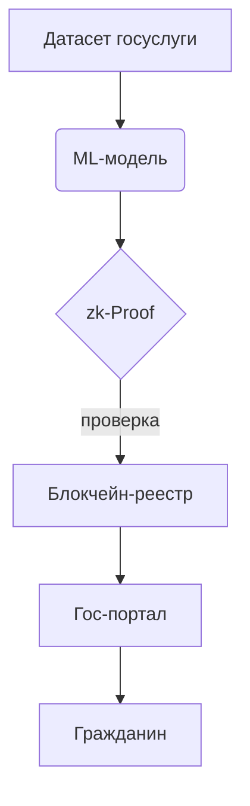

## Готовый контент и места вставки  

### 1. Раздел «Государство-2.0: Web 3.0-парадигма»  
*Файл*: `content/web3-governance.md` (новая страница, ссылка из главного меню)

> Web 3.0 выводит цифровое государство на новый уровень. Вместо централизованных баз данных — распределённые реестры, где **каждая транзакция проверяема**; вместо бумажной бюрократии — *смарт-контракты*, мгновенно исполняющие «код как закон».  
>  
> Три ключевых преимущества для государственного сектора:  
> – **Self-sovereign identity (SSI)**. Гражданин хранит идентификационные данные у себя, делясь лишь необходимыми атрибутами. Это минимизирует утечки и упрощает KYC-процедуры.  
> – **Неизменяемые реестры**. Регистры земель, авто и лицензий становятся прозрачными: любое изменение мгновенно фиксируется на блокчейне, устраняя простор для коррупции.  
> – **dApp-госуслуги**. Подача заявки, выплата пособия или голосование происходят через децентрализованные приложения без посредников и «человеческого фактора».  
>  
> *Мини-кейс*: Эстония интегрировала X-Road c DID-кошельками; 99% госуслуг доступны онлайн, а 100% медкарт хранятся в распределённом регистре.  
>  
> > **Что дальше?** Изучите, как DAO-механизмы дополняют Web 3.0-госуслуги в разделе «DAO и бюджетирование».

### 2. Подраздел «Verifiable AI»  
*Файл*: `content/ai/verifiable-ai.md` (подпункт раздела «AI-Native Government»)

> **Verifiable AI** — это искусственный интеллект, решения которого можно криптографически подтвердить. Модели не скрываются «в чёрном ящике»; проверка корректности выполняется так же, как проверяются блокчейн-транзакции.  
>  
> Технологии:  
> – **zk-SNARKs**: создают короткое криптодоказательство того, что модель сделала расчёт по заданному алгоритму, не раскрывая параметры.  
> – **Cryptographic commitments**: фиксируют веса модели в неизменяемом хэше; любая подмена сразу обнаруживается.  
>  
> **Преимущества перед обычным AI**:  
> – Прозрачность процессов принятия решений.  
> – Юридическая ответственность: при аудите можно доказать корректность выводов.  
> – Киберустойчивость: доказательство не позволяет подменить модель или данные незаметно.  



### 3. Подраздел 4.1 «Метрики DAO-казначейств»  
*Файл*: `content/dao/treasury-metrics.html` (вложить в раздел «DAO и бюджетирование»)

#### Ключевые показатели (июль 2025)  

| Метрика | Значение | Изменение за 12 мес. |
|---|---|---|
| Активные DAO | 30,842 | +19% |
| Совокупный treasury | $40.7 млрд | +22% |
| Средний treasury 100 крупнейших | $187 млн | +15% |

#### Статичная диаграмма Chart.js  

```html


const ctx = document.getElementById('daoTreasury');
new Chart(ctx, {
  type: 'doughnut',
  data: {
    labels: ['100 крупнейших', 'Прочие DAO'],
    datasets: [{
      data: [18700, 22000],   // значения в млн $
      backgroundColor: ['#4caf50', '#2196f3']
    }]
  },
  options: {
    plugins: { legend: { position: 'bottom' } },
    cutout: '60%'
  }
});

Распределение средств в DAO-экосистеме, июль 2025
```

*Обновляйте массив `data:` вручную при выпуске новых отчётов DeepDAO.*

## Куда именно вставить  

| Контент | Куда добавить | Что изменить в навигации |
|---|---|---|
| `web3-governance.md` | Папка `content/`; добавить ссылку в `index.html` под блоком вступления | В меню «Web 3.0 для государства» |
| `ai/verifiable-ai.md` | Подпапка `content/ai/`; вложить ссылку из страницы «AI-Native Government» | Добавить якорь `#verifiable-ai` |
| `dao/treasury-metrics.html` | Подпапка `content/dao/`; встроить `` или включить через Jekyll include | В меню раздела «DAO и бюджетирование» |

Добавив эти файлы и ссылки, сайт получит свежие данные, объяснит принципы проверяемого ИИ и продемонстрирует масштабы DAO-экономики.